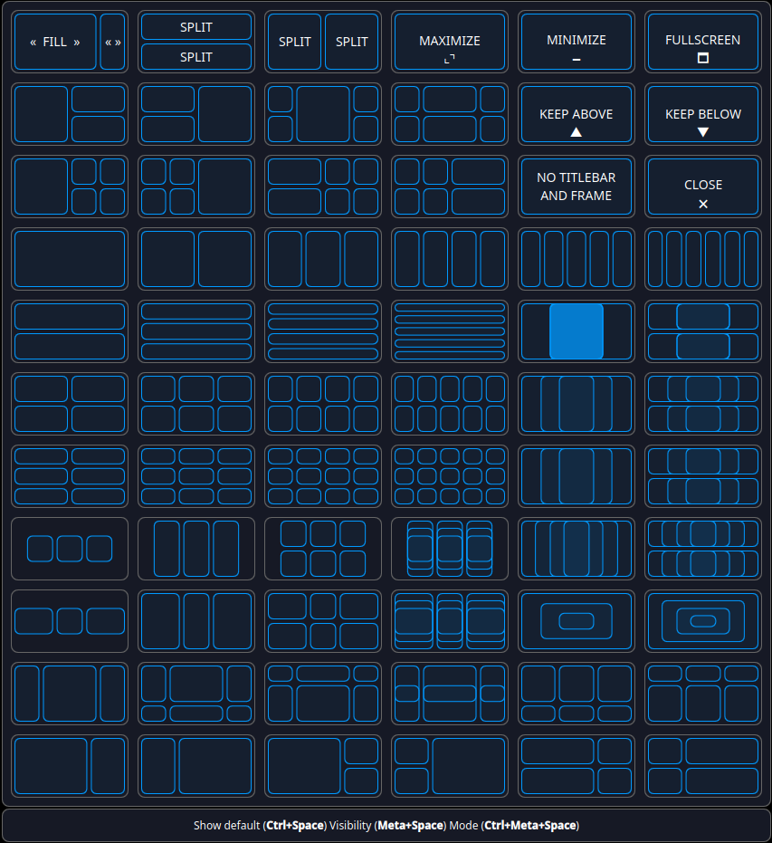
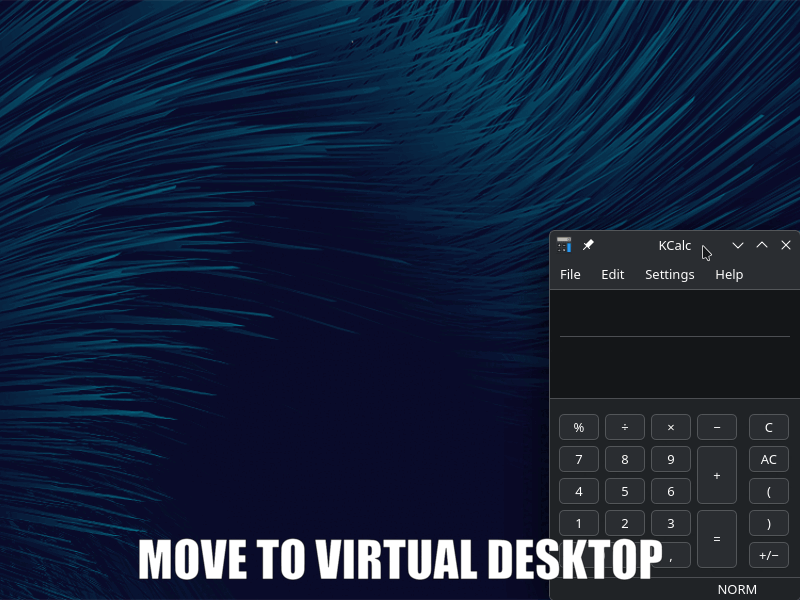
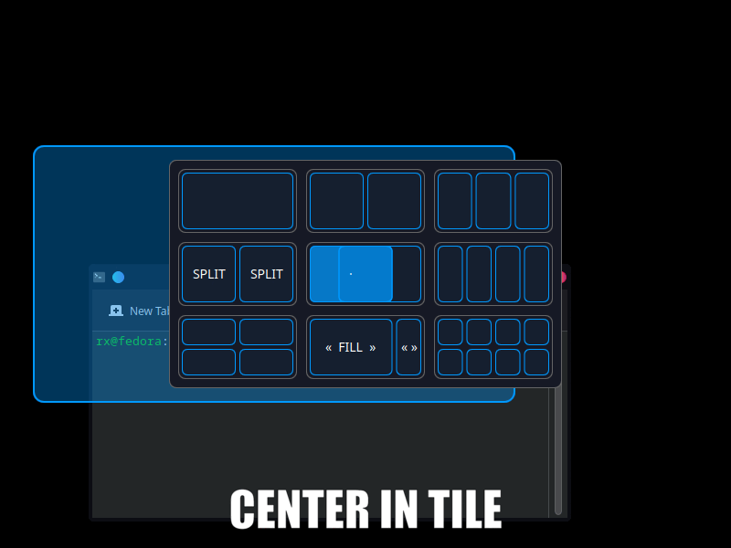

# Mouse Tiler


<pre>
KDE KWin Script for tiling windows.
Allows you to tile your windows with minimum effort by moving the mouse just a few pixels.
</pre>

* Compatible with KDE Plasma 6+ (compatibility with previous versions is unknown).

* Tested on:
    - Fedora 42 KDE running Wayland and X11 with Plasma version 6.5.2 and 6.5.4
    - Debian 13 running Plasma version 6.3.6
    - FreeBSD 15.0 running X11 with Plasma version 6.4.5

[](https://store.kde.org/p/2334027)


# Table of contents
<ul>
<li><a href="#features">Features</a>
    <ul>
        <li><a href="#features_released">Released so far</a></li>
        <li><a href="#features_planned">Planned for v1.0.0 (and beyond)</a></li>
    </ul>
</li>
<li><a href="#how">How it works</a></li>
<li><a href="#installation">Installation</a>
    <ul>
        <li><a href="#store">From KDE Store (Recommended)</a></li>
        <li><a href="#file">From File</a></li>
    </ul>
</li>
<li><a href="#setup">Recommended setup</a></li>
</li>
<li><a href="#system-settings">Changing system settings</a></li>
<li><a href="#remove-settings">Manually erasing settings</a></li>
<li><a href="#troubleshooting">Troubleshooting</a>
    <ul>
        <li><a href="#commandline">Command line</a></li>
    </ul>
</li>
<li><a href="#compatibility">Compatibility</a></li>
<li><a href="#getintouch">Get in touch</a></li>
</ul>

## <p id="features"></p>Features

* Two mouse tiling modes - Popup Grid and Overlay ( similar to FancyZones ) - you can use one or both
* Virtual desktop management
* Auto tiling (carousel or stacking style)
* Manual text configuration of the modes or [web layout editor](https://rxweb.epizy.com/mousetiler/editor.html)
* Multi-monitor support
* Follow system theme or use one of pre-defined color themes
* Highly customizable, from tile size to grid position (over 20 settings)
* Tiling works using mouse, stylus, touch (including Wacom) - press Ctrl+Alt+I to toggle input modes, or change default input mode in settings

<br>
**Feature Preview**

<br>
**Grid Tiler Default**

<br>
**Grid Tiler All Layouts**

<br>
**Overlay Tiler**

<br>
**Virtual Desktop Manager**

<br>
**Center In Tile**

**Auto Tiling**
[See video overview of auto-tiling here](https://www.youtube.com/watch?v=wKhfUGHrgIw)<br>

### <p id="features_planned"></p>Planned for the future

The future features depend on you.

Read this for details:
[Planned features and donation goals](https://github.com/rxappdev/MouseTiler/blob/main/PLANNEDFEATURES.md)

Voting and current results:

[](https://wakatime.com/polls/0e8054f0-e168-4f00-b31b-ed6c17bd51af)


### Feature requests to investigate

* Add additional titlebar button ? - System Settings > Colours & Themes > Window Decorations > ... > Configure Titlebar Buttons... (currently I do not believe this is possible to do from a KWin Script, but if anyone knows something I don't, please let me know)
* Re-investigate single key shortcuts (Alt / Shift / Ctrl)

## <p id="how"></p>How it works

Use one of two mouse adapted tilers (or both). The Grid tiler lets you quickly place your window by moving the window a few pixels. The Overlay tiler is a classical full screen overlay that lets you place your window into one tile, or span multiple tiles. Define your own layouts or use some of the many predefined ones.

### Use auto tiling

If you like using auto-tiling, there is fairly advanced support for carousel and regular auto tiling. Switch between up to three auto-tilers on the fly (Ctrl+Alt+X and Ctrl+Alt+C). Scroll overflowing windows by using left and right screen edges (or Ctrl+Alt+Left and Ctrl+Alt+Right). Toggle auto-tiling with Ctrl+Alt+A.

### Manage your virtual desktops

You can add new virtual destkops, auto-remove empty destkops, move apps between desktops and more.

### Center in tile

If you want to keep a window size, but center it in a certain place, you can use the center in tile shortcut (Meta+Ctrl+C).

## <p id="installation"></p>Installation

### <p id="store"></p>From KDE Store (Recommended)

1) Open `System Settings` > `Window Management` > `KWin Scripts`.

2) Click the `Get New...` in upper right corner.<br>
<br>
3) Search for `Mouse Tiler` and click on it (step `1` applies only with small window size)<br>
<br>
4) Click `Install`<br>
<br>
5) Enable `Mouse Tiler`<br>
<br>
6) Click `Apply`<br>
<br>
7) Click the configure icon to change the settings to your liking<br>
<br>

Please note that changing settings requires some additional steps to apply due to a KDE limitation - see `Changing settings` below for more information.

### <p id="file"></p>From File

You can download the `mousetiler.kwinscript` file and install it through **System Settings**.
1) Download the .kwinscript file.
2) Open `System Settings` > `Window Management` > `KWin Scripts`.
3) Click the `Install from File...` in upper right corner.<br>
<br>
4) Select the downloaded file and click `Open`
5) Enable `Mouse Tiler`<br>
<br>
6) Click `Apply`<br>
<br>
7) Click the configure icon to change the settings to your liking<br>
<br>

Please note that changing settings requires some additional steps to apply due to a KDE limitation - see `Changing settings` below for more information.

## <p id="system-settings"></p>Changing system settings

### **`IMPORTANT`**

Due to a bug in KDE, changing user configuration requires reloading the script. (A reboot works too.)

To make setting changes effective, **reload the script as follows**:

1) In `System Settings` > `Window Management` > `KWin Scripts`, untick `Mouse Tiler`<br>
<br>
2) Click `Apply`<br>
<br>
3) Tick `Mouse Tiler`<br>
<br>
4) Click `Apply`<br>
<br>

### <p id="remove-settings"></p>Manually erasing settings

If there is ever need to manually erase user data (do not do this unless you are a developer or really need it).

The application/window data is stored in `~/.config/kde.org/kwin.conf` under the key `...`.

The system user settings data is stored in `~/.config/kwinrc` under `[Script-mousetiler]`.

## <p id="troubleshooting"></p>Troubleshooting

### Remove screen edge highlight

To remove the visual screen edge highlighting when using the auto-tiler go to:

`System Settings` > `Window Management` > `Desktop Effects`

And disable "`Highligt Screen Edges and Hot Corners`".

### <p id="commandline"></p>Command line

In case there are any issues (such as a crash - which should never happen but just in case), this is how to disable the script from command line (open a console with `Ctrl+Alt+F5`):

```
kwriteconfig6 --file kwinrc --group Plugins --key mousetilerEnabled false
qdbus org.kde.KWin /KWin reconfigure
```

If the mouse tiler configuration contains corrupted data, it can be manually deleted in the file: `~/.config/kde.org/kwin.conf` under key `TBD`.

## <p id="compatibility"></p>Compatibility ##

Compatible with:
* <a href="https://github.com/rxappdev/RememberWindowPositions">Remember Window Positions</a> - use the Mouse Tiler to move your windows into position, and restore them next time you start the application. Ultimate combo. (Originally Remember Window Positions was meant to be part of the Mouse Tiler).

## <p id="getintouch"></p>Get in touch ##

Join the official discord channel https://discord.gg/Js6AYsnQQj to discuss, report bugs or find guides.